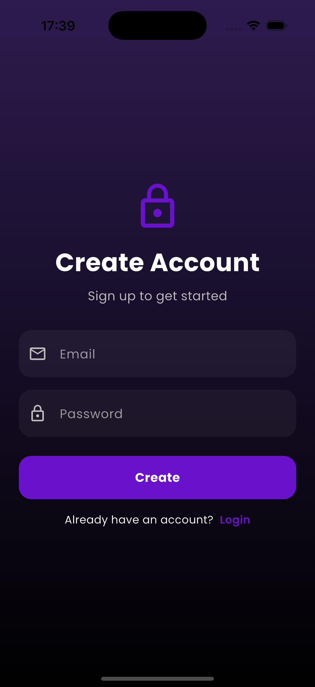
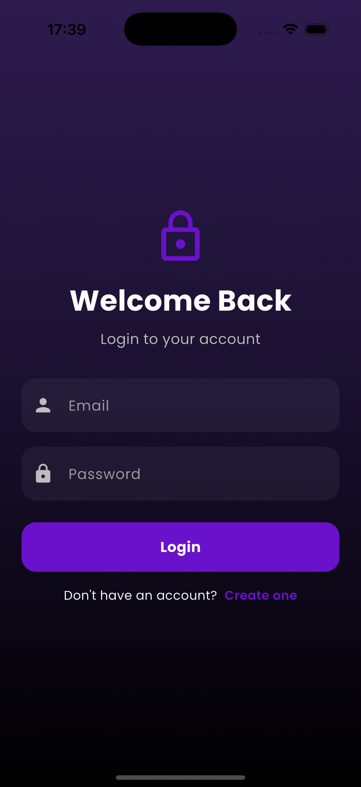
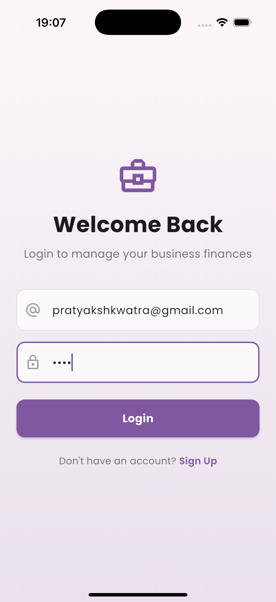
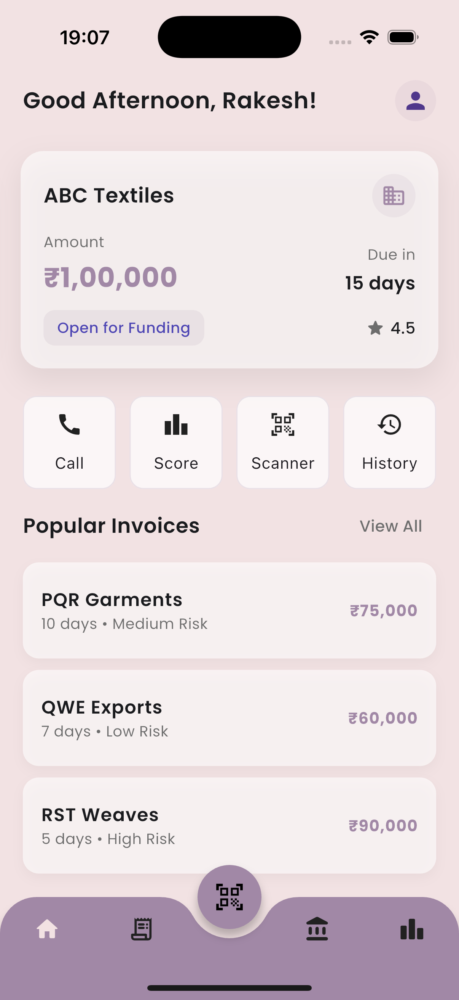
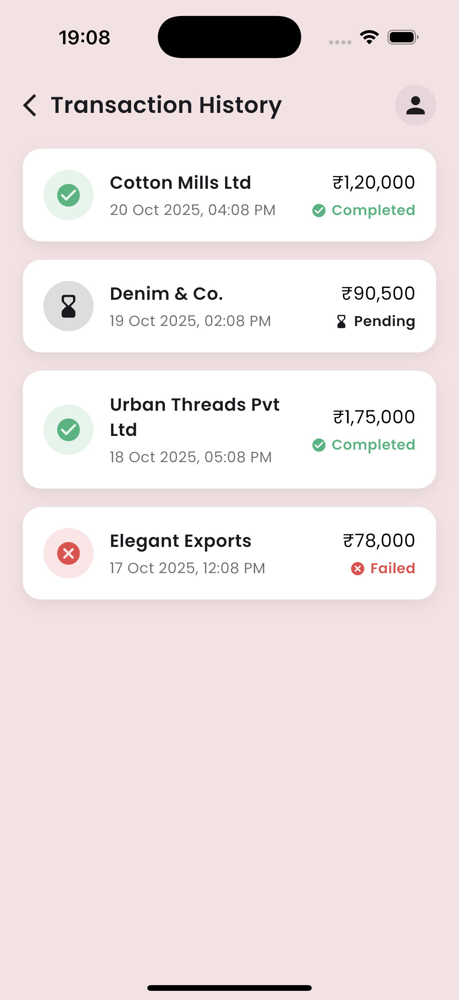
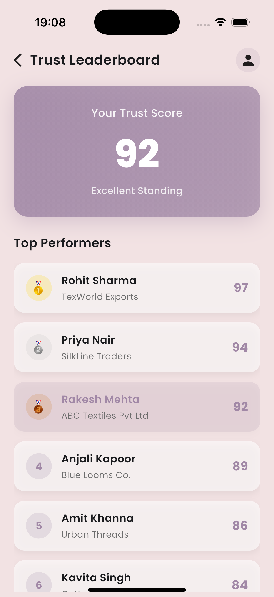
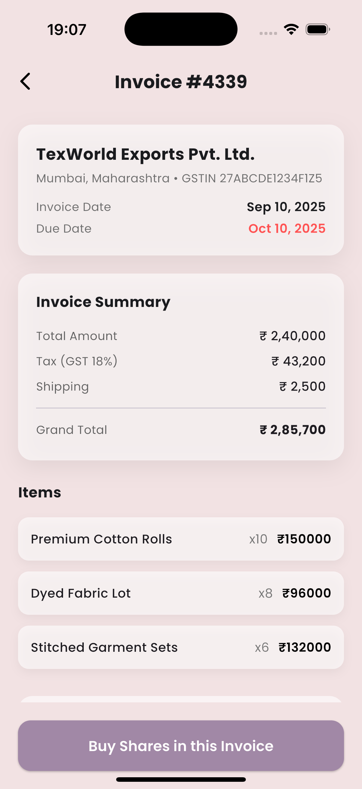
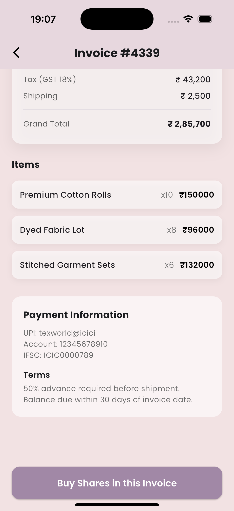
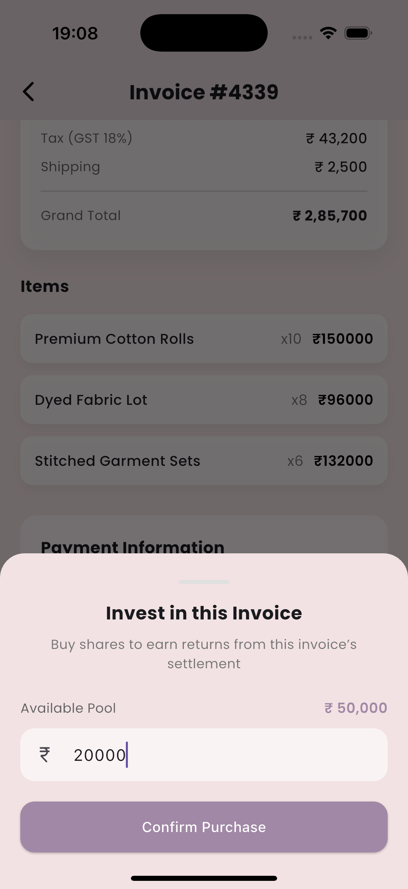

# FlowFin Frontend

This repository contains the source code for the official **Flutter mobile application** for **FlowFin**, a platform designed to automate and streamline **supply chain financing**.

The application provides a **user-friendly interface** to interact with the FlowFin Backend API, enabling businesses to track invoices, manage financing, and view transaction history.

The app is designed with a **clean, intuitive, and light-themed interface** to make supply chain finance management accessible.

---

## ✨ Features

* 🔐 **Secure Authentication** — Simple and secure sign-up and login flow using JWT.
* 📊 **Invoice Tracking** — View lists of invoices with status tracking (Created, Processed, Completed).
* 📄 **Detailed Invoice View** — Access comprehensive details for each invoice, including amounts, dates, items, and payment information.
* 📈 **Invoice Investment** — Ability for users to invest (buy shares) in available invoice pools.
* 📜 **Transaction History** — Browse a history of past transactions with status indicators (Completed, Pending, Failed).
* 🏆 **Trust Leaderboard** — View user rankings based on a trust score, promoting transparency and reliability within the platform.
* 📱 **Sleek & Responsive UI** — A modern, clean design built with Flutter for cross-platform consistency (iOS, Android, Web, Desktop).

---

## 📸 Screenshots

Below are the key screens from the FlowFin mobile application:

### 🧭 Authentication & Onboarding

| Create Account                                    | Login                           | Filled Login                                  |
| ------------------------------------------------- | ------------------------------- | --------------------------------------------- |
|  |  |  |

### 🏠 Main Screens

| Home                          | Invoices                              | Transaction History                                         | Trust                           |
| ----------------------------- | ------------------------------------- | ----------------------------------------------------------- | ------------------------------- |
|  |  |  |  |

### 📄 Invoice Details & Investment

| Invoice Full                                  | Invoice Full (2)                                  | Invoice Full Invest                                         |
| --------------------------------------------- | ------------------------------------------------- | ----------------------------------------------------------- |
|  |  |  |

---

## 🛠 Technology Stack

This application is built with **Flutter** for a high-performance, cross-platform mobile experience.

* **Framework:** Flutter
* **Language:** Dart
* **State Management:** Provider *(or similar — verify implementation)*
* **API Client:** Dio
* **Secure Storage:** flutter_secure_storage
* **UI Components:** Flutter Material Components, Google Fonts, Carousel Slider, FL Chart, Animated Bottom Navigation Bar

---

## ⚙️ Installation & Setup

This application requires the **FlowFin Backend API** to be running.

### Prerequisites

* Flutter SDK installed
* A running instance of the FlowFin Backend API

### Steps

```bash
# Clone the repository
git clone <repository-url>
cd flowfin_frontend

# Install dependencies
flutter pub get

# Run the application
flutter run
```

🟢 The app should now be running on your connected device or simulator.

Ensure the backend API is running locally at:

```
http://localhost:8000
```

(You can verify or change the base URL in `lib/api/api_client.dart`.)

---

## 🧩 Problem Statement

Design and develop a **robust backend service** to manage the core operations of a supply chain financing platform.

The system must handle:

* Secure user authentication
* Database connectivity for financial data
* A clean API for front-end applications to process invoices, manage users, and facilitate financing workflows.

---

## 💜 Made with Love

Made with 💜 by:

* [Pratyaksh Kwatra](https://github.com/pratyakshkwatra)
* [Harshita Aggarwal](https://github.com/harshitaaggarwall)
* [Manya Jain](https://github.com/Manyajain10-abc)
* [Kanishka Upadhyay](https://github.com/kanishkaupadhyay08)
